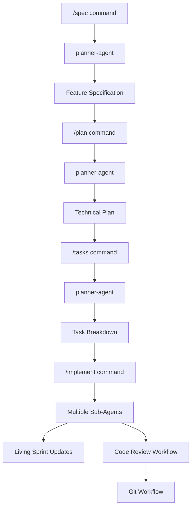
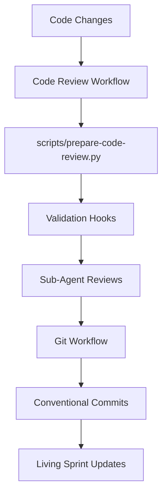
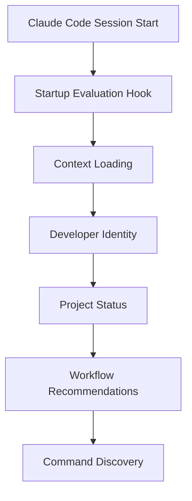

# Claude Code Workflow Integration Map

**Last Updated**: 2025-09-21
**Integration Map Version**: 1.0.0

## Overview

This document maps how Claude Code workflows connect, depend on each other, and integrate with the broader development ecosystem. Use this to understand workflow relationships, plan changes, and troubleshoot integration issues.

## Workflow Dependency Graph

### Primary Workflow Chains

#### **Feature Development Chain**



#### **Quality Assurance Chain**



#### **Developer Onboarding Chain**



### Cross-Cutting Integration Points

#### **Living Sprint Integration**

- **Connected Workflows**: Feature Development, Progress Tracking, Git Workflow, Startup Evaluation
- **Integration Type**: Bidirectional - workflows update sprint, sprint informs workflow decisions
- **Data Flow**: Sub-agent completion → progress updates → sprint status → startup recommendations

#### **Sub-Agent Coordination**

- **Connected Workflows**: Feature Development, Code Review, Workflow Orchestration
- **Integration Type**: Hub-and-spoke - orchestrator coordinates all sub-agent interactions
- **Data Flow**: Workflow triggers → orchestrator delegation → sub-agent execution → result aggregation

#### **Context7 Research Integration**

- **Connected Workflows**: Feature Development, Workflow Optimization, Documentation Updates
- **Integration Type**: Service dependency - workflows call Context7 for best practices research
- **Data Flow**: Research triggers → Context7 queries → pattern documentation → workflow implementation

## Component Dependency Matrix

### Core Dependencies

| Component              | Depends On                             | Used By                                 | Critical Path |
| ---------------------- | -------------------------------------- | --------------------------------------- | ------------- |
| **planner-agent**      | Context7, project docs                 | Feature Development, Planning workflows | Yes           |
| **Living Sprint**      | Roadmaps, developer identity           | All progress tracking workflows         | Yes           |
| **Sub-Agent System**   | Orchestrator, workflow state           | Feature Development, Code Review        | Yes           |
| **Startup Evaluation** | Project context, developer config      | Developer onboarding                    | No            |
| **Git Workflow**       | Code Review, conventional standards    | All development workflows               | Yes           |
| **Hook System**        | Claude Code platform, validation rules | Automation workflows                    | No            |

### Integration Dependencies

| Integration               | Primary Component      | Secondary Component   | Dependency Type          |
| ------------------------- | ---------------------- | --------------------- | ------------------------ |
| **Feature → Sprint**      | Feature Development    | Living Sprint         | Data dependency          |
| **Review → Git**          | Code Review            | Git Workflow          | Sequential dependency    |
| **Startup → Context**     | Startup Evaluation     | Project Documentation | Read dependency          |
| **Planning → Research**   | Feature Development    | Context7 Integration  | Service dependency       |
| **Orchestrator → Agents** | Workflow Orchestration | Sub-Agent System      | Control dependency       |
| **Progress → Identity**   | Progress Tracking      | Developer Identity    | Configuration dependency |

## Data Flow Analysis

### Information Flow Patterns

#### **Feature Development Data Flow**

1. **Input**: Feature description or roadmap item
2. **Research**: Context7 best practices, existing component discovery
3. **Planning**: Technical specification with architectural compliance
4. **Task Generation**: Executable task breakdown with sub-agent assignments
5. **Implementation**: Coordinated sub-agent execution with progress tracking
6. **Output**: Implemented feature with documentation and living sprint updates

#### **Quality Assurance Data Flow**

1. **Input**: Code changes and staged files
2. **Validation**: Multi-tier testing (lint, fast, full validation)
3. **Review**: Sub-agent quality assessment and feedback generation
4. **Integration**: Git workflow with conventional commit generation
5. **Output**: Quality-validated changes with comprehensive review artifacts

#### **Progress Tracking Data Flow**

1. **Input**: Sub-agent completion events and developer activities
2. **Processing**: Living sprint updates and roadmap progress calculation
3. **Synthesis**: Developer status overview and workflow recommendations
4. **Output**: Updated project status and next action guidance

### State Management

#### **Workflow State Persistence**

- **Location**: Various files in `.claude/` and `docs/00-project/`
- **Synchronization**: Manual with automation development in progress
- **Consistency**: Cross-document validation needed
- **Recovery**: Manual rollback procedures

#### **Session State Management**

- **Startup State**: Loaded via startup evaluation hook
- **Execution State**: Maintained by orchestrator during workflow execution
- **Completion State**: Persisted to living sprint and project documents
- **Error State**: Handled by 2-attempt rule with human escalation

## Integration Patterns

### Successful Integration Patterns

#### **Hub-and-Spoke Pattern** (Sub-Agent Coordination)

- **Hub**: Workflow orchestrator
- **Spokes**: Specialized sub-agents (planner, development, reviewer, etc.)
- **Benefits**: Centralized coordination, consistent state management, clear responsibility
- **Application**: Feature development, code review, workflow orchestration

#### **Pipeline Pattern** (Feature Development)

- **Stages**: Specify → Plan → Tasks → Implement
- **Flow**: Sequential with validation gates between stages
- **Benefits**: Clear progression, quality gates, rollback capability
- **Application**: Feature development workflow, planning workflows

#### **Observer Pattern** (Progress Tracking)

- **Subject**: Sub-agent completion events
- **Observers**: Living sprint, roadmap tracking, startup evaluation
- **Benefits**: Decoupled progress updates, multiple progress views
- **Application**: Progress tracking, status reporting

### Integration Challenges and Solutions

#### **Cross-Document Consistency**

- **Challenge**: Manual synchronization between living sprint, roadmaps, and workflow docs
- **Current Solution**: Manual updates with validation procedures
- **Future Solution**: Automated synchronization workflow
- **Mitigation**: Regular consistency checks, clear update procedures

#### **State Management Complexity**

- **Challenge**: Workflow state spread across multiple files and systems
- **Current Solution**: Orchestrator maintains session state, manual persistence
- **Future Solution**: Centralized state management with automated persistence
- **Mitigation**: Clear state boundaries, recovery procedures

#### **Hook Automation Reliability**

- **Challenge**: Hook failures can disrupt workflow automation
- **Current Solution**: Graceful degradation, manual fallbacks
- **Future Solution**: Robust error handling, automated recovery
- **Mitigation**: Comprehensive testing, monitoring, fallback procedures

## Workflow Communication Protocols

### Orchestrator → Sub-Agent Communication

```json
{
  "delegation_pattern": "structured_input",
  "input_schema": "agent-specific schemas",
  "output_validation": "JSON schema compliance",
  "error_handling": "2-attempt rule with escalation",
  "context_preservation": "orchestrator maintains state"
}
```

### Workflow → Living Sprint Integration

```json
{
  "update_pattern": "event_driven",
  "trigger_events": ["sub_agent_completion", "milestone_completion", "blocker_resolution"],
  "data_format": "structured progress updates",
  "synchronization": "manual with automation development"
}
```

### Context7 → Workflow Integration

```json
{
  "research_pattern": "on_demand_queries",
  "query_types": ["best_practices", "implementation_patterns", "validation_approaches"],
  "response_processing": "pattern_extraction_and_documentation",
  "caching": "research_findings_cached_for_reuse"
}
```

## Integration Testing Strategy

### Integration Validation Points

#### **Workflow Chain Validation**

- **Feature Development**: Specify → Plan → Tasks → Implement chain integrity
- **Quality Assurance**: Code Review → Git Workflow integration
- **Progress Tracking**: Sub-agent completion → Living sprint updates

#### **Cross-System Integration**

- **Context7 Integration**: Research queries and pattern application
- **Sub-Agent Coordination**: Orchestrator delegation and result aggregation
- **Documentation Synchronization**: Cross-document consistency validation

#### **Error Handling Validation**

- **Graceful Degradation**: Workflow continues with reduced functionality
- **Recovery Procedures**: Clear recovery from integration failures
- **Escalation Paths**: Human escalation for unresolvable integration issues

### Integration Monitoring

#### **Health Checks**

- **Dependency Availability**: Context7, sub-agents, documentation files
- **Data Consistency**: Cross-document synchronization validation
- **Performance Metrics**: Workflow execution time, integration latency

#### **Failure Detection**

- **Integration Failures**: Communication errors between workflow components
- **Data Inconsistencies**: Mismatched information across integrated systems
- **Performance Degradation**: Slower integration response times

## Future Integration Development

### Planned Integration Enhancements

#### **Automated Progress Tracking** (Q4 2025)

- **Integration**: Hook-based automation for living sprint updates
- **Trigger**: Sub-agent completion events
- **Benefits**: Reduced manual overhead, consistent progress tracking

#### **Cross-Document Synchronization** (Q1 2026)

- **Integration**: Automated validation and synchronization system
- **Scope**: Living sprint, roadmaps, workflow documentation
- **Benefits**: Eliminated documentation drift, improved consistency

#### **Workflow Analytics Integration** (Q1 2026)

- **Integration**: Performance monitoring and bottleneck analysis
- **Data Sources**: Workflow execution metrics, developer feedback
- **Benefits**: Data-driven workflow optimization

### Integration Architecture Evolution

#### **Service-Oriented Integration**

- **Direction**: Move toward service-based integration patterns
- **Benefits**: Better error handling, improved modularity, easier testing
- **Timeline**: Gradual transition with backward compatibility

#### **Event-Driven Integration**

- **Direction**: Implement event-driven patterns for workflow coordination
- **Benefits**: Better decoupling, improved scalability, easier monitoring
- **Timeline**: Foundation development in 2026

---

**This integration map provides comprehensive understanding of Claude Code workflow relationships, enabling effective workflow development, troubleshooting, and optimization.**
