# Mermaid Diagram Syntax

Syntax patterns and examples for generating Mermaid diagrams.

---

## Architecture Diagrams (graph)

**Purpose**: Show system components and their relationships

**Syntax**: `graph [direction]` where direction = TD (top-down), LR (left-right), BT, RL

### Basic Example

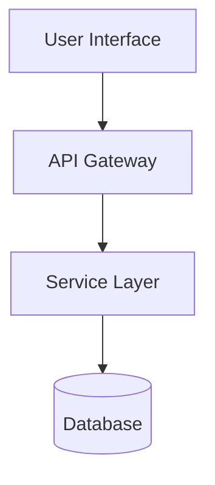

### With Styling

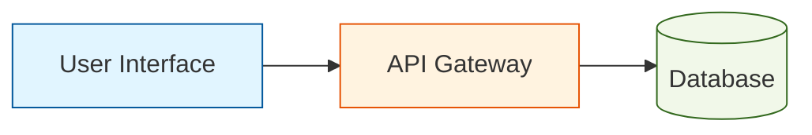

### Node Shapes

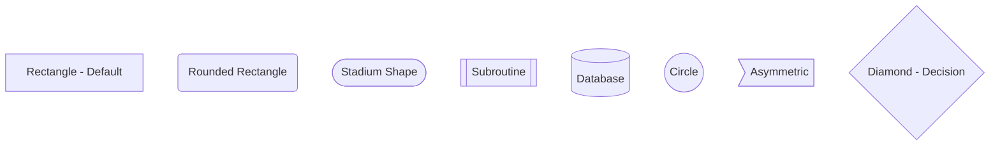

**Use**:
- Rectangle: Default components/services
- Rounded: User-facing elements
- Database: Data storage
- Diamond: Decision points
- Circle: Start/end points

---

## Flow Diagrams (flowchart)

**Purpose**: Show process flow with decision points

**Syntax**: `flowchart [direction]`

### Example

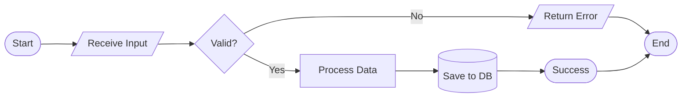

### Special Nodes

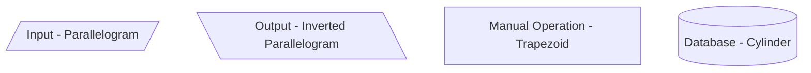

**Best Practices**:
- Use decision diamonds for branching
- Label edges with conditions (|Yes|, |No|, |Error|)
- Keep flow unidirectional (avoid backward arrows unless loop)
- Start/end with stadium shapes

---

## Sequence Diagrams

**Purpose**: Show interactions between actors/components over time

**Syntax**: `sequenceDiagram`

### Example

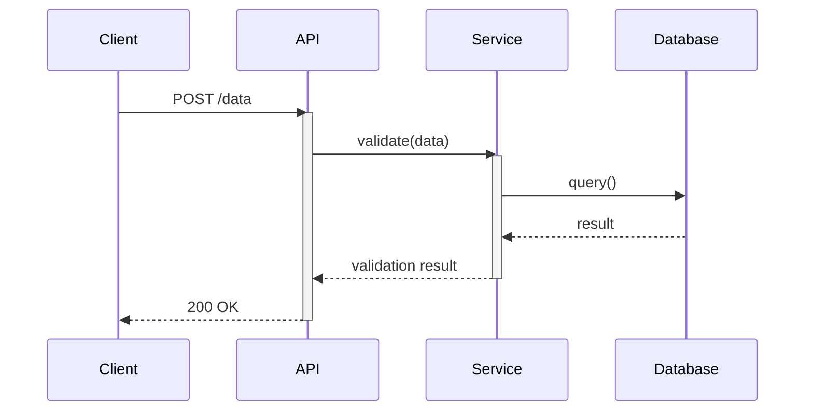

### Arrow Types

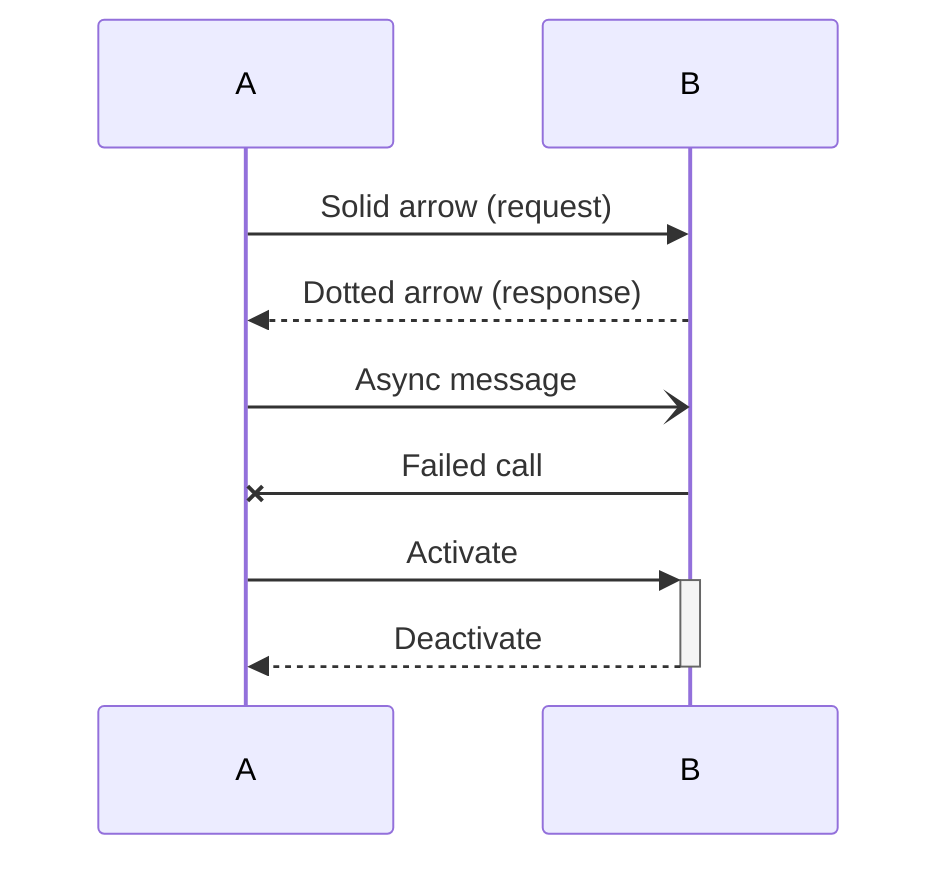

**Notes and Boxes**:

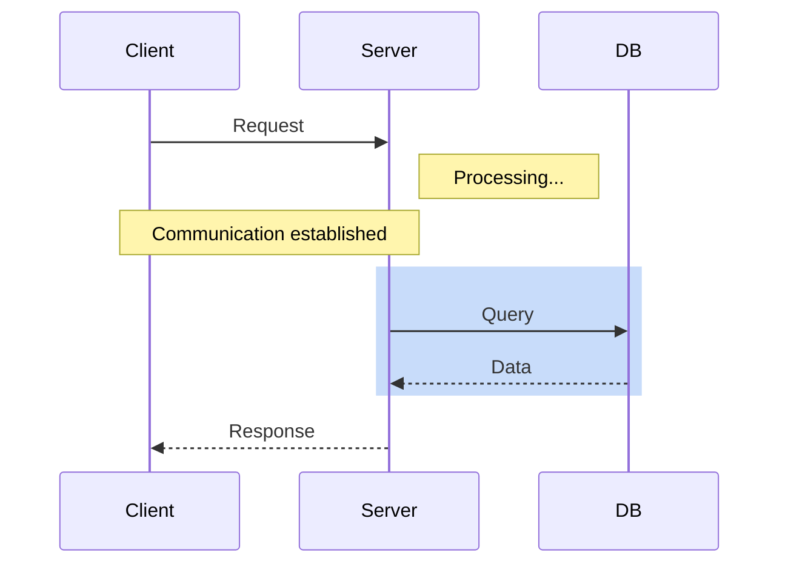

**Best Practices**:
- Participant names at top (use aliases for long names)
- Use activation bars for processing
- Group related interactions in boxes
- Add notes for complex logic

---

## Class Diagrams

**Purpose**: Show component relationships and structure

**Syntax**: `classDiagram`

### Example

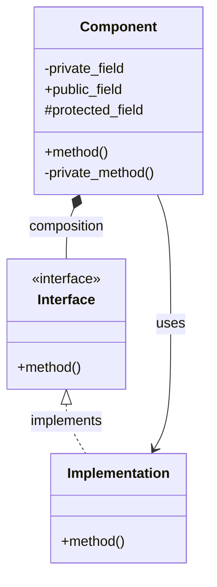

### Relationship Types

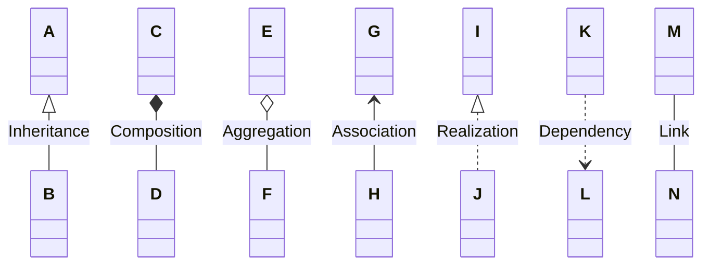

**Use**:
- Inheritance: Subclass relationships
- Composition: "Has-a" (strong ownership)
- Aggregation: "Has-a" (weak ownership)
- Dependency: Uses temporarily

---

## State Diagrams

**Purpose**: Show state transitions

**Syntax**: `stateDiagram-v2`

### Example

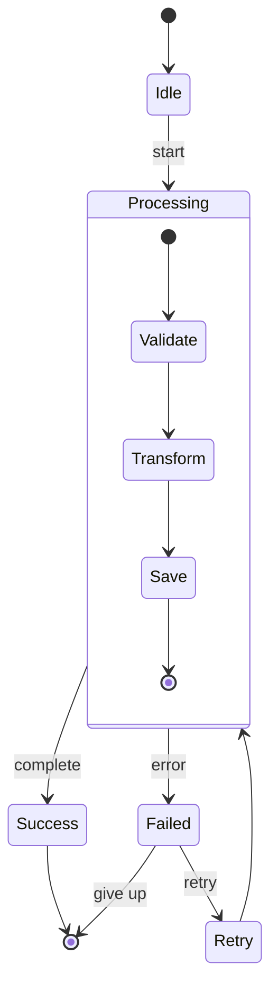

**Best Practices**:
- Start/end with `[*]`
- Label transitions clearly
- Use composite states for complex processes
- Keep flat (avoid deep nesting)

---

## Entity Relationship Diagrams

**Purpose**: Show database schema relationships

**Syntax**: `erDiagram`

### Example

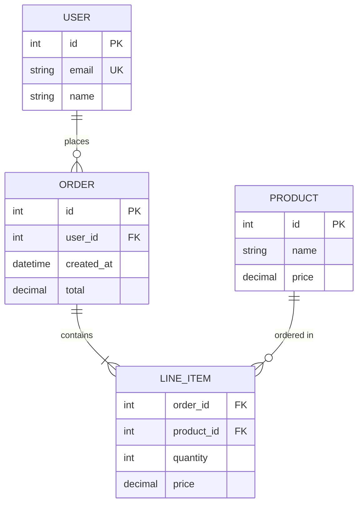

### Cardinality

```
||--|| : One to One
||--o{ : One to Many
}o--o{ : Many to Many
}|--|{ : One or More to One or More
```

---

## General Best Practices

### Complexity Management

**Keep diagrams focused**:
- Max 10-12 nodes (architecture/flow)
- Max 5-6 participants (sequence)
- Max 8-10 classes (class diagram)

**If too complex**:
- Split into multiple diagrams (by layer, by feature)
- Use "..." to indicate omitted components
- Create overview + detail diagrams

### Labeling

**Good labels**:
- Descriptive: "User Service" not "Service1"
- Consistent: Same terminology as codebase
- Concise: 2-4 words maximum
- Action-oriented for edges: "validates", "sends", "queries"

**Bad labels**:
- Generic: "Component A", "Thing"
- Verbose: "The service that handles user authentication and authorization"
- Inconsistent: "UserSvc" in one place, "User Service" in another

### Layout

**Direction selection**:
- `TD` (top-down): Hierarchies, flows with clear start/end
- `LR` (left-right): Timelines, pipelines, sequences
- `BT` (bottom-up): Rarely used, avoid unless specific need
- `RL` (right-left): Rarely used, avoid unless specific need

**Spacing**: Mermaid auto-layouts, but you can influence:
- Group related components together in code
- Use subgraphs for logical grouping
- Minimize edge crossings (order nodes thoughtfully)

### Styling

**When to use**:
- Highlight different component types (frontend, backend, data)
- Distinguish critical paths
- Show error/success states

**How**:
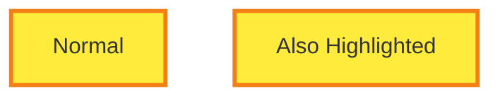

**Don't overdo it**: Max 3-4 style classes per diagram

---

## Diagram Type Selection

| Need | Diagram Type | Use When |
|------|--------------|----------|
| System components | graph TD/LR | Showing architecture layers, services |
| Process flow | flowchart | Showing workflow, decision logic |
| Interactions | sequenceDiagram | API calls, message passing |
| Class structure | classDiagram | OOP design, interfaces |
| State changes | stateDiagram-v2 | Lifecycle, status transitions |
| Data model | erDiagram | Database schema, entities |

---

## Validation Checklist

**Before finalizing diagram**:
- [ ] Renders without syntax errors
- [ ] All nodes have clear labels
- [ ] Direction appropriate for content
- [ ] Complexity manageable (<12 nodes)
- [ ] Terminology matches codebase
- [ ] Edge labels clear (where applicable)
- [ ] Styling enhances (not distracts)
- [ ] Legend included if needed

---

## Common Syntax Errors

**Avoid**:
```mermaid
graph TD
    A --> B[Missing arrow direction]  ❌
    C ->D[Wrong arrow syntax]  ❌
    E[Unclosed bracket  ❌
    F(Mismatched parens]  ❌
```

**Correct**:
```mermaid
graph TD
    A --> B[Proper syntax]  ✅
    C --> D[Another node]  ✅
    E[Closed properly]  ✅
    F(Matched parens)  ✅
```

**Special characters**: Use quotes for labels with special chars:
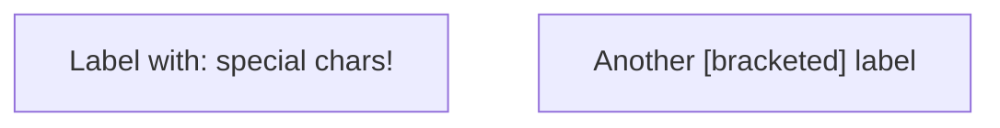

---

## Quick Reference

### Arrows
- `-->` : Solid arrow
- `-.->` : Dotted arrow
- `==>` : Thick arrow
- `--text-->` : Labeled arrow

### Nodes
- `[text]` : Rectangle
- `(text)` : Rounded
- `([text])` : Stadium
- `[[text]]` : Subroutine
- `[(text)]` : Database
- `((text))` : Circle
- `{text}` : Diamond
- `{{text}}` : Hexagon

### Subgraphs
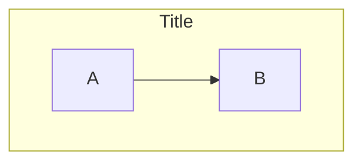
