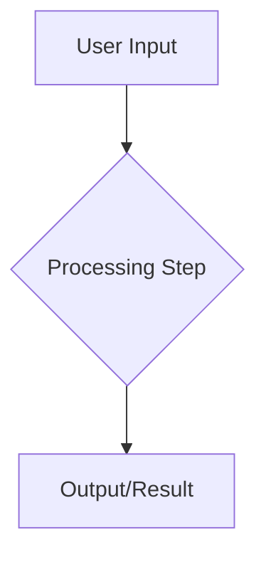

<!--
USAGE INSTRUCTIONS:
1. Replace all [PLACEHOLDER] text with your project-specific content
2. Remove or customize HTML comments (like this one) as needed
3. Keep sections that apply to your project, remove others
4. Update the frontmatter (title, date, status, tags)
5. This template follows the Spec-Driven Development (SDD) methodology

For detailed guidance on filling out this template, see:
- docs/04-guides/development/spec-driven-development.md
-->

# **[PROJECT_NAME] Specification**

**Version:** 1.0 | **Status:** [DRAFT|ACTIVE|DEPRECATED]

<!--
Replace [PROJECT_NAME] with your project name (e.g., "Financial Analysis System")
Set version appropriately (use semantic versioning: 1.0, 1.1, 2.0, etc.)
Status: DRAFT during development, ACTIVE when approved, DEPRECATED when replaced
-->

## **Part 1: The Business & User Framework**

<!--
This section focuses on WHAT and WHY - the business value and user needs.
Avoid technical implementation details here - those go in Part 2.
-->

### **1. High-Level Business Case**

<!--
Explain the business problem this project solves.
Answer: Why does this project exist? What problem does it solve?
Target length: 3-5 paragraphs
-->

**Problem Statement:** [Describe the specific problem your target users face. What pain points are they experiencing? What inefficiencies exist in current solutions?]

**Target Market/Audience:** [Define who will use this system. Be specific about user types, roles, and organizations.]

**Ultimate Business Goal:** [What is the measurable business outcome? How will success be defined? Focus on user wins and business value.]

**Core Value Proposition:**

<!--
List 3-5 key value propositions - what makes your solution valuable?
Format as numbered or bulleted list
-->

1. **[Value Proposition 1]:** [Brief explanation of first key benefit]
2. **[Value Proposition 2]:** [Brief explanation of second key benefit]
3. **[Value Proposition 3]:** [Brief explanation of third key benefit]

**Success Metrics (SLOs):**

<!--
Define measurable Service Level Objectives.
Examples: Response time, cost per operation, uptime, accuracy
Format: Metric name + target value + measurement method
-->

- **[Metric Name]:** [Target value and measurement method]
- **[Metric Name]:** [Target value and measurement method]
- **[Metric Name]:** [Target value and measurement method]

### **2. User Personas & Stories**

<!--
Create 1-3 primary user personas representing your target audience.
Each persona should include: Role, Goals, Frustrations, Key Interactions
-->

#### **2.1 User Persona: [Persona Name]**

- **Role & Goals:** [What is this user trying to accomplish? What are their responsibilities?]
- **Frustrations:** [What problems do they face today? What inefficiencies waste their time?]
- **Key Interaction:** [How will they primarily interact with your system?]

#### **2.2 User Stories**

<!--
Organize user stories into Epics (major feature areas).
Use standard format: "As a [persona], I want to [action], so that [benefit]."
Mark MVP stories clearly - these are your first deliverables.
-->

**Epic 1: [Epic Name - Core Functionality]**

- **Story 1.1 (MVP):** As [persona], I want to [action], so that [benefit].
- **Story 1.2:** As [persona], I want to [action], so that [benefit].

**Epic 2: [Epic Name - Advanced Features]**

- **Story 2.1:** As [persona], I want to [action], so that [benefit].
- **Story 2.2:** As [persona], I want to [action], so that [benefit].

### **3. Data & Business Workflow**

<!--
Describe the high-level workflow of your system.
Use mermaid diagrams or simple numbered steps.
Focus on business flow, not technical implementation.
-->

**Workflow Diagram:**

**Workflow Steps:**

1. **[Step 1 Name]:** [Description of what happens in this step]
2. **[Step 2 Name]:** [Description of what happens in this step]
3. **[Step 3 Name]:** [Description of what happens in this step]

### **4. Customer Pain Points to Features Transformation**

<!--
Map each customer pain point to a specific feature solution.
This ensures every feature has clear business justification.
-->

**Strategic Approach:** [Explain your approach to solving customer problems through features]

**Pain Point → Feature Mapping:**

| **Customer Pain Point** | **Feature Solution** | **Measurable Win** |
| ----------------------- | -------------------- | ------------------ |
| [Pain point 1] | [Feature that solves it] | [How success is measured] |
| [Pain point 2] | [Feature that solves it] | [How success is measured] |
| [Pain point 3] | [Feature that solves it] | [How success is measured] |

**Feature Prioritization Framework:**

<!--
Define how you'll prioritize features (e.g., P0 = critical, P1 = important, P2 = nice-to-have)
-->

1. **[Priority Level] Features (P0):** [Description of what makes a feature this priority]
   - [Feature category or criteria]

2. **[Priority Level] Features (P1):** [Description]
   - [Feature category or criteria]

## **Part 2: The Technical & Operational Framework**

<!--
This section focuses on HOW - the technical implementation and operations.
Be specific about technologies, architectures, and operational requirements.
-->

### **5. Core Values & Rule Hierarchy**

<!--
Define the guiding principles for technical decisions.
These values help resolve trade-offs and design conflicts.
-->

- **Mission Statement:** [One sentence describing the technical mission]
- **Core Values:**
  - **Principle 1:** [Description of first core technical principle]
  - **Principle 2:** [Description of second core technical principle]
  - **Principle 3:** [Description of third core technical principle]
- **Rule Hierarchy (Chain of Command):** [Define priority order when rules conflict, e.g., "Security > Performance > Convenience"]

### **6. Operational Boundaries & Safety**

<!--
Define safety rules, security requirements, and operational limits.
These are non-negotiable constraints the system must respect.
Format as numbered rules for clarity.
-->

- **Rule 6.1 [Rule Category]:** [Specific rule description with clear constraint]
- **Rule 6.2 [Rule Category]:** [Specific rule description with clear constraint]
- **Rule 6.3 [Rule Category]:** [Specific rule description with clear constraint]

### **7. Functional Specification**

<!--
This is the detailed "how it works" section.
Define components, their responsibilities, and their interfaces.
-->

#### **7.1. Component Responsibilities**

<!--
List each major component/service/agent with its responsibilities.
Use table format for clarity.
Include: Name, Role, Responsibilities, Key Tools/Technologies
-->

| Component Name | Persona/Role | Core Responsibilities | Key Tools/Technologies |
| :------------- | :----------- | :-------------------- | :--------------------- |
| **[Component 1]** | [Brief role description] | 1. [Responsibility 1] 2. [Responsibility 2] | [Technology stack] |
| **[Component 2]** | [Brief role description] | 1. [Responsibility 1] 2. [Responsibility 2] | [Technology stack] |

#### **7.2. Data Requirements & Standards**

<!--
Define data formats, schemas, and quality standards.
Include any specific requirements for data handling.
-->

**Data Standards:**

| **Requirement** | **Specification** | **Implementation** |
| :-------------- | :---------------- | :----------------- |
| [Requirement name] | [What is required] | [How it's implemented] |
| [Requirement name] | [What is required] | [How it's implemented] |

### **8. Architectural Blueprint**

<!--
Describe your system architecture.
Include: Architecture style, layer descriptions, technology choices, rationale
-->

The system implements a **[ARCHITECTURE_STYLE]** architecture with [NUMBER] layers:

#### **8.1 Architecture Overview**

**Layer 1: [Layer Name]**

- **Purpose:** [What this layer does]
- **Capabilities:** [Key capabilities this layer provides]
- **Technology:** [Technology/framework used]

**Layer 2: [Layer Name]**

- **Purpose:** [What this layer does]
- **Capabilities:** [Key capabilities this layer provides]
- **Technology:** [Technology/framework used]

#### **8.2 Core Architecture Details**

<!--
Provide detailed technical specifications:
- How components communicate
- State management approach
- Tool/API integrations
- Non-functional requirements (observability, security, performance)
-->

- **[Architecture Aspect 1]:** [Detailed description]
- **[Architecture Aspect 2]:** [Detailed description]
- **State Management:** [How state is managed and persisted]
- **Tooling:** [External tools and APIs integrated]
- **Non-Functional Requirements:**
  - **Observability:** [Logging, monitoring, tracing approach]
  - **Security:** [Security measures and compliance]
  - **Performance:** [Performance targets and optimization strategies]

### **9. Technology Stack Rationale**

<!--
Justify major technology choices.
For each technology: Rationale, Benefits, Why chosen over alternatives
-->

#### **9.1 Core Technology Justifications**

**[Technology/Framework 1]**

- **Rationale:** [Why this technology was chosen]
- **Benefits:** [Key benefits it provides]
- **Alternatives Considered:** [What else was evaluated and why this won]

**[Technology/Framework 2]**

- **Rationale:** [Why this technology was chosen]
- **Benefits:** [Key benefits it provides]
- **Alternatives Considered:** [What else was evaluated and why this won]

### **10. Executable Specification & Testing (MVP)**

<!--
Define acceptance criteria for MVP using Given/When/Then format.
These become the basis for integration tests.
-->

**Feature:** [MVP Feature Name]

- **Scenario:** [Describe the test scenario]
- **Given** [initial state or precondition]
- **When** [action or event occurs]
- **Then** [expected outcome]
- **And** [additional expected outcome]

---

## Appendix

<!--
Optional: Add any supplementary information
- Glossary of terms
- References to related documents
- External standards or regulations
- Research citations
-->

### Glossary

- **[Term 1]:** [Definition]
- **[Term 2]:** [Definition]

### Related Documents

- [Document name and link]
- [Document name and link]

---

**Document History:**

| Version | Date | Author | Changes |
| :------ | :--- | :----- | :------ |
| 1.0 | [YYYY-MM-DD] | [Your Name] | Initial draft |

<!--
END OF TEMPLATE
Remember to:
1. Replace ALL [PLACEHOLDERS]
2. Remove or customize HTML comments
3. Keep sections relevant to your project
4. Reference this template in your project documentation
-->
